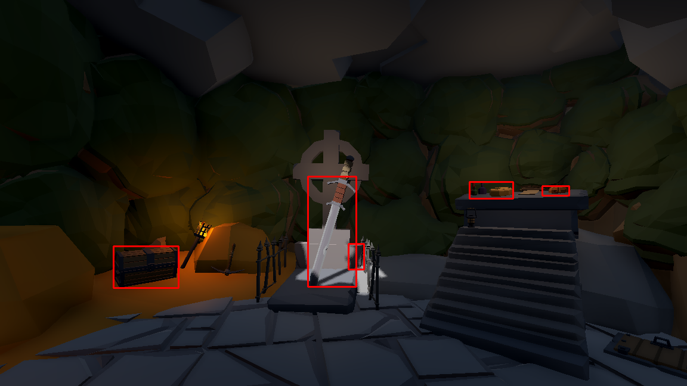
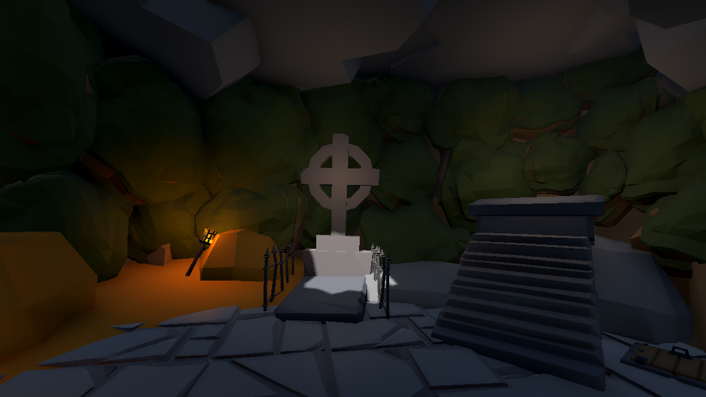
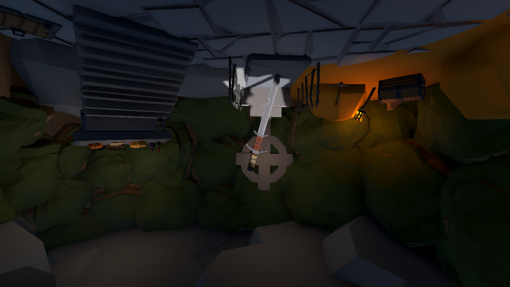

<p align="center">
  <h1 align="center">Automatic Detection of Differences Between Two Images</h1>
  <h2 align="center">İki Fotoğraf Arasındaki Farkı Algılama</h2>
  <p align="center">
    <strong>Hüseyin Mert Çalışkan</strong> - 210223044
  </p>
  <div align="center"><small>Interactive Image Processing Project with Godot Engine & OpenCV</small></div>
  <h3 align="center"><a href="docs/imge_210223044.pdf">📄 Research Paper</a></h3>
</p>

<p align="center">
  <a href="">
    
  </a>
</p>

## 🎯 Project Overview

This project demonstrates **automatic difference detection** between two scene images using **HSV color space analysis**. Built with **Godot Engine 3.5** for interactive 3D environment and **Python/OpenCV** for image processing pipeline.

### What It Does
- **3D Scene Navigation**: First-person player movement in interactive environment
- **Screenshot Capture**: Take photos of scene with/without objects
- **Automatic Processing**: HSV-based difference detection with morphological filtering
- **Visual Results**: Bounding boxes around detected differences

## 🛠️ Technology Stack

**Frontend (Godot Engine 3.5)**
- 3D scene rendering with interactive objects
- First-person camera controls
- Screenshot capture system
- Real-time visualization

**Backend (Python + OpenCV)**
- HSV color space conversion
- Hue & Saturation channel analysis  
- Morphological operations (opening/closing)
- Contour detection and filtering

## 🎮 How It Works

### 1. Scene Setup
- Navigate through 3D environment using WASD + mouse
- Scene contains interactive objects that can be toggled on/off

### 2. Image Capture
```gdscript
# capture.gd - Screenshot system
func capture_pair():
    _save_screenshot("full_scene.png")      # Scene with objects
    interactive.visible = false
    _save_screenshot("background_only.png") # Empty background
    interactive.visible = true
```

### 3. Difference Detection
```python
# diff_pipeline.py - Core processing
# HSV conversion and channel analysis
hsv_full = cv2.cvtColor(full, cv2.COLOR_BGR2HSV)
hsv_bg = cv2.cvtColor(bg, cv2.COLOR_BGR2HSV)

# Calculate H & S channel differences
dh = cv2.absdiff(h_full, h_bg)
ds = cv2.absdiff(s_full, s_bg)

# Create binary mask and apply morphology
mask = cv2.bitwise_or(mh, ms)
mask = cv2.morphologyEx(mask, cv2.MORPH_OPEN, kernel)
```

### 4. Result Visualization
- Detected differences marked with red bounding boxes
- Results saved automatically to `screenshots/differences_marked.png`

## 📁 Project Structure

```
godot-image-difference-detection/
├── 📂 scripts/
│   ├── capture.gd              # Screenshot capture system
│   └── Player.gd               # First-person controller
├── 📂 py_scripts/
│   └── diff_pipeline.py        # Image processing pipeline
├── 📂 screenshots/             # Captured images & results
├── 📂 assets/                  # 3D models, textures
├── 📂 scenes/                  # Godot scene files
├── 📂 docs/                    # Research paper
├── project.godot               # Main Godot project
└── requirements.txt            # Python dependencies
```

## 🔬 Algorithm Details

### HSV Color Space Analysis
- **Hue Threshold**: 10 (color difference detection)
- **Saturation Threshold**: 30 (intensity difference detection)  
- **Channel Combination**: OR operation between H and S masks

### Morphological Operations
- **Opening**: 3×3 kernel (noise removal)
- **Closing**: 7×7 kernel (gap filling)
- **Iterations**: 1 pass each operation

### Contour Filtering
- **Minimum Area**: 300 pixels
- **Aspect Ratio**: 0.01 - 5.0 range
- **Bounding Box**: Red rectangles around valid regions

## 📸 Sample Results

| Background Only | Full Scene | Detected Differences |
|----------------|------------|---------------------|
|  |  |  |

## 🎮 Controls

- **WASD**: Movement
- **Mouse**: Look around  
- **Space**: Jump
- **Screenshot Key**: Capture image pair and process

## 📄 Research Paper

Complete methodology and experimental analysis available in Turkish:
**📋 [Research Paper (PDF)](docs/imge_210223044.pdf)**

## 🏗️ Built With

- **Godot Engine 3.5** - 3D environment and interaction
- **Python 3.8** - Image processing backend
- **OpenCV 4.x** - Computer vision operations
- **NumPy** - Mathematical operations

## 👨‍💻 Author

**Hüseyin Mert Çalışkan** - 210223044  
Computer Engineering Student Project

---

*This project demonstrates practical application of computer vision techniques in an interactive 3D environment for educational purposes.*